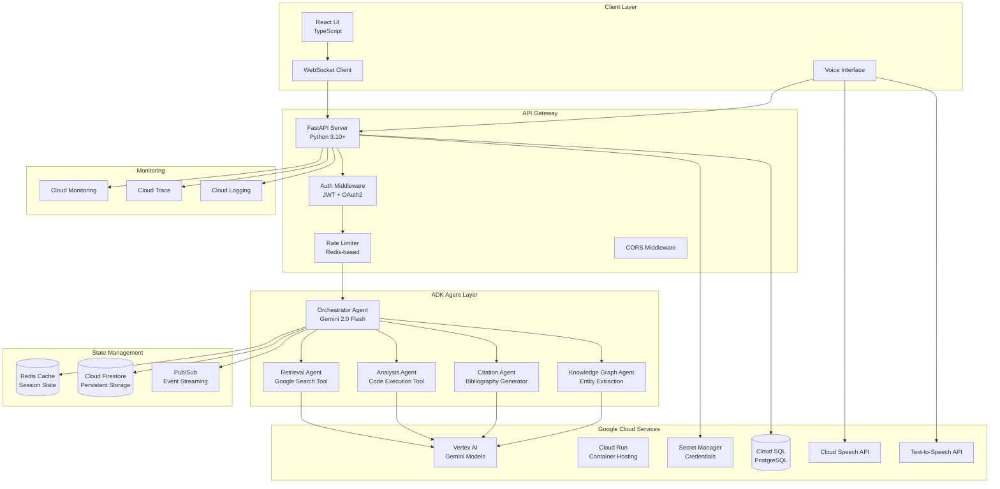
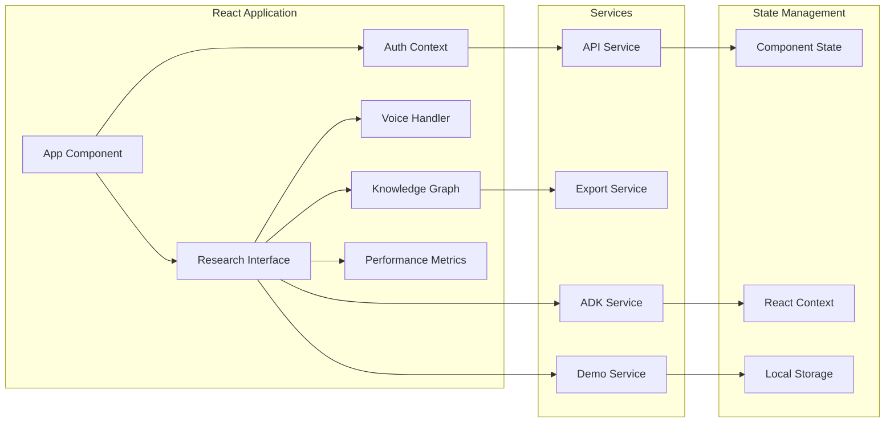
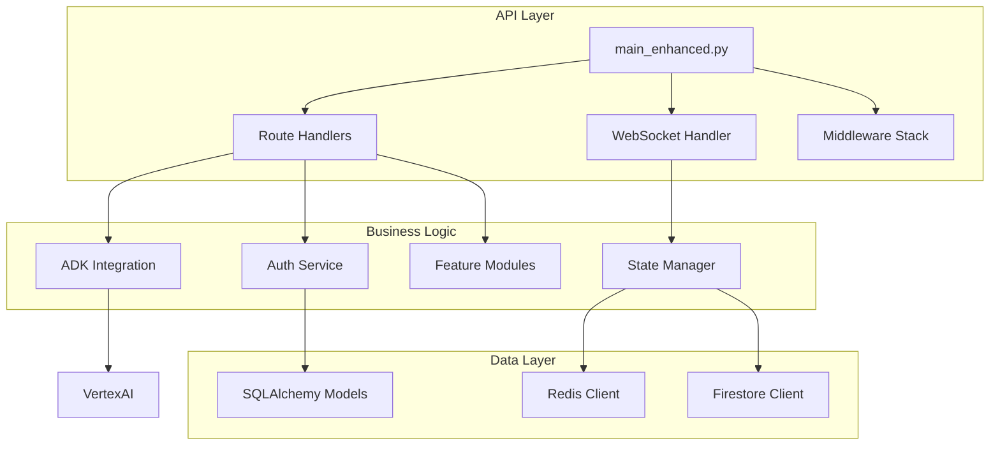
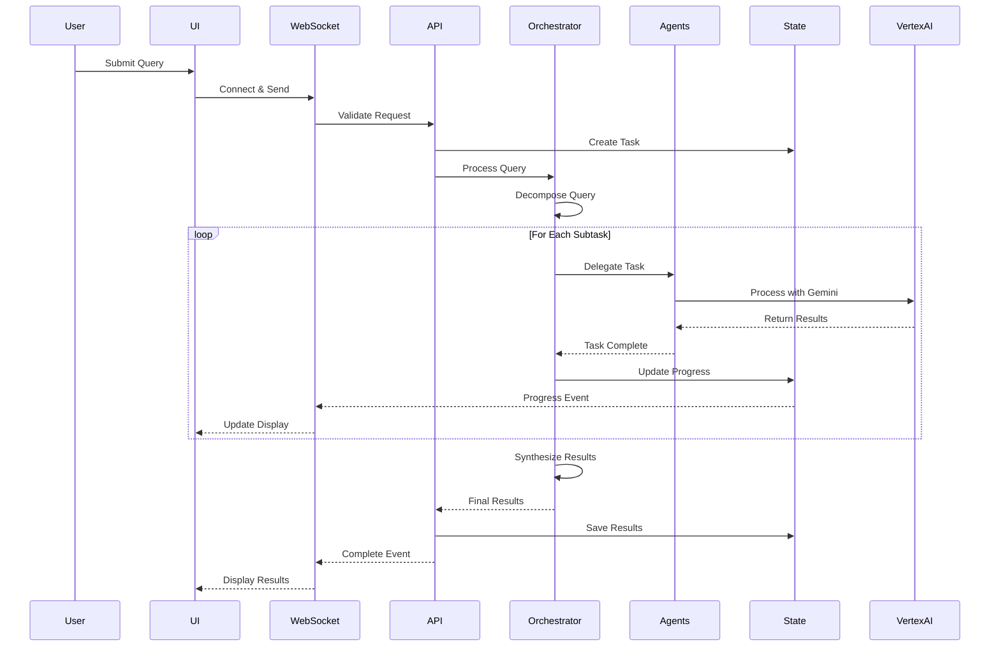
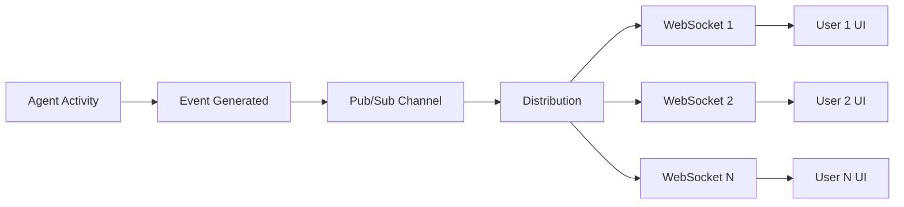
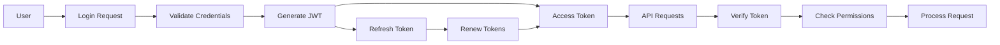
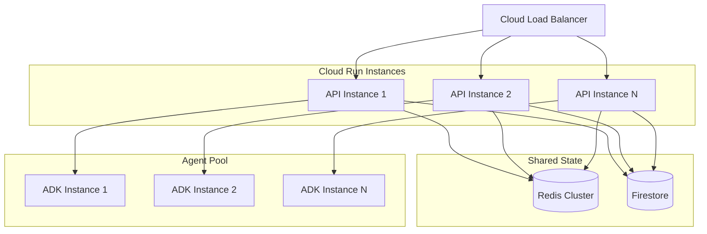
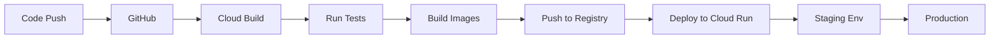

# 🏗️ Parallax Pal Architecture

## System Overview

Parallax Pal is a multi-agent research platform built on Google Cloud's Agent Development Kit (ADK). The system uses a hierarchical agent architecture where a master orchestrator coordinates specialized agents for comprehensive research tasks.

## Architecture Diagram



## Component Architecture

### Frontend Architecture



### Backend Architecture



## Agent Hierarchy

### Master Orchestrator
- **Model**: Gemini 2.0 Flash
- **Temperature**: 0.7
- **Role**: Coordinates all research activities
- **Responsibilities**:
  - Query decomposition
  - Task delegation
  - Progress monitoring
  - Result synthesis
  - Error handling

### Specialized Agents

#### 1. Retrieval Agent
- **Model**: Gemini 2.0 Flash
- **Temperature**: 0.3 (factual accuracy)
- **Tools**: Google Search API
- **Responsibilities**:
  - Web search with domain filtering
  - Source credibility assessment
  - Content extraction
  - Metadata collection

#### 2. Analysis Agent
- **Model**: Gemini 2.0 Flash
- **Temperature**: 0.5 (balanced)
- **Tools**: Code Execution
- **Responsibilities**:
  - Content synthesis
  - Pattern identification
  - Statistical analysis
  - Insight generation

#### 3. Citation Agent
- **Model**: Gemini 2.0 Flash
- **Temperature**: 0.1 (high precision)
- **Tools**: None (pure LLM)
- **Responsibilities**:
  - Citation formatting (APA, MLA, Chicago, IEEE)
  - Source deduplication
  - Bibliography generation
  - Metadata validation

#### 4. Knowledge Graph Agent
- **Model**: Gemini 2.0 Flash
- **Temperature**: 0.4 (structured output)
- **Tools**: None (pure LLM)
- **Responsibilities**:
  - Entity extraction
  - Relationship identification
  - Graph structure generation
  - Confidence scoring

## Data Flow

### Research Request Flow



### Real-time Update Flow



## Security Architecture

### Authentication Flow



### Security Layers

1. **Network Security**
   - HTTPS/WSS encryption
   - CORS configuration
   - Trusted host validation

2. **Authentication**
   - JWT with refresh tokens
   - OAuth2 integration
   - API key support

3. **Authorization**
   - Role-based access (Admin, User)
   - Resource-level permissions
   - Operation rate limiting

4. **Input Validation**
   - SQL injection prevention
   - XSS sanitization
   - Command injection blocking

5. **Rate Limiting**
   - Per-user limits
   - Per-operation limits
   - WebSocket connection limits

## Scalability Design

### Horizontal Scaling



### Caching Strategy

1. **Redis Cache Layers**
   - Session state (TTL: 1 hour)
   - Research results (TTL: 24 hours)
   - User preferences (TTL: 7 days)
   - Rate limit counters (TTL: window-based)

2. **Firestore Persistence**
   - Research history
   - User profiles
   - Collaboration data
   - Analytics data

3. **CDN Caching**
   - Static assets
   - Demo query results
   - Public research data

## Performance Optimization

### Agent Optimization
- Parallel task execution
- Result streaming
- Intelligent caching
- Query deduplication

### Database Optimization
- Connection pooling
- Query optimization
- Index management
- Read replicas

### Network Optimization
- WebSocket compression
- HTTP/2 support
- Request batching
- CDN distribution

## Monitoring & Observability

### Metrics Collection

```yaml
System Metrics:
  - Request rate
  - Response time
  - Error rate
  - Cache hit rate
  - Active users

Agent Metrics:
  - Task completion time
  - Success rate
  - Token usage
  - Error frequency

Resource Metrics:
  - CPU utilization
  - Memory usage
  - Network I/O
  - Database connections
```

### Logging Strategy

```yaml
Log Levels:
  ERROR: System errors, failures
  WARNING: Performance issues, degradation
  INFO: Request handling, agent activity
  DEBUG: Detailed execution flow

Log Structure:
  - Timestamp
  - Request ID
  - User ID
  - Agent name
  - Operation
  - Duration
  - Status
  - Metadata
```

### Alerting Rules

```yaml
Critical Alerts:
  - Error rate > 5%
  - Response time > 10s
  - Agent failure
  - Database connection failure

Warning Alerts:
  - Error rate > 1%
  - Response time > 5s
  - High memory usage (>80%)
  - Rate limit exceeded
```

## Deployment Architecture

### CI/CD Pipeline



### Environment Configuration

```yaml
Development:
  - Local Redis
  - Local PostgreSQL
  - Vertex AI dev project
  - Debug logging

Staging:
  - Cloud Redis
  - Cloud SQL
  - Vertex AI staging project
  - Info logging

Production:
  - Redis cluster
  - Cloud SQL HA
  - Vertex AI prod project
  - Error logging only
```

## Disaster Recovery

### Backup Strategy
- Database: Daily automated backups
- Firestore: Real-time replication
- Code: Git repository
- Secrets: Secret Manager versioning

### Recovery Procedures
1. Service failure: Auto-restart with Cloud Run
2. Database failure: Failover to replica
3. Region failure: Multi-region deployment
4. Complete failure: Restore from backups

## Future Architecture Considerations

### Planned Enhancements
1. **GraphQL API**: For more efficient data fetching
2. **Event Sourcing**: For complete audit trail
3. **Microservices**: Split monolith into services
4. **Kubernetes**: For more complex orchestration
5. **Multi-region**: Global distribution

### Scalability Roadmap
- Phase 1: Current architecture (1K users)
- Phase 2: Add read replicas (10K users)
- Phase 3: Microservices split (100K users)
- Phase 4: Global distribution (1M+ users)